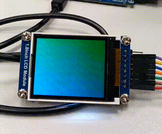
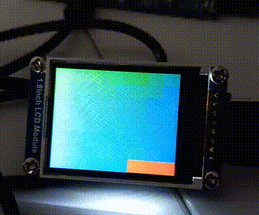
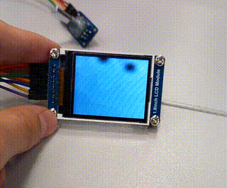
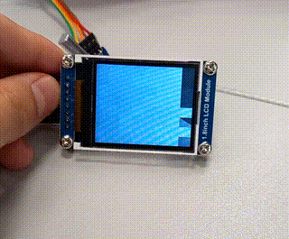
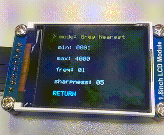
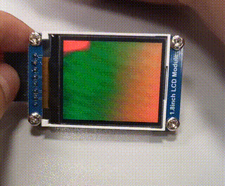

# ToF_3D
Student project that leverages the VL53L5CX Time of Flight (ToF) sensor in conjunction with the LPC55S69 microcontroller. The project is designed to explore the capabilities of the ToF sensor and demonstrate its potential in real-world applications.

## How To Use

> [!IMPORTANT]
> You need to properly plug pins with project configuration for ToF, LCD and encoder to properly launch application.

After the build process is complete, proceed to install the application on your microcontroller. The sensor will undergo a brief initialization process, after which it should promptly display a live image on the LCD screen. Note that the sensor is capable of reading data solely in the form of an 8x8 pixel matrix.

## Modes

Users have the option to select from a range of interpolation modes, to enhance the result image, including:

* **Color Bilinear** - Smoothly interpolate colors between pixels.
 

* **Color Nearest** - Choose the nearest color to each pixel.
 

* **Color Bicubic** -  Apply a higher-quality interpolation method for color blending.
 

* **Grey Bilinear** - Smoothly interpolate shades of grey between pixels.
  

 
* **Grey Nearest** - Choose the nearest shade of grey to each pixel.
 

* **Grey Bicubic** - Apply a higher-quality interpolation method for grey blending.
 

## Menu
Additionally, user can adjust values using build-in menu:

  

Values that can be modified:
* **Data read mode** - how sensor data will be transformed before its
* **Minimal sensor data read** [m] - value from 1 - 4000 meters
* **Maximal sensor data read** [m] - value from 1 - 4000 meters
* **Frequency refresh update** [GHz] - how fast sensor will refresh data from 1 - 60 [GHz]
* **Sharpness** - "[The sharpener is used to remove some or all of the signal caused by a veiling glare](https://www.st.com/resource/en/user_manual/um2884-a-guide-to-using-the-vl53l5cx-multizone-timeofflight-ranging-sensor-with-a-wide-field-of-view-ultra-lite-driver-uld-stmicroelectronics.pdf#page=10)", value from 0 - 99

> [!NOTE]
> Recomended frequency for optimal sensor work with given config is 30 [GHz]

  

### ToF Limitations

* **Pixel Refreshment Distance Constraint** - At larger distances, the sensor may encounter pixel refreshment issues, where some pixels may not update in real-time with the rest.

* **Ambient Light Sensitivity** - Ambient light can affect the sensor's performance, especially in outdoor environments or brightly lit indoor settings. While the sensor incorporates measures to mitigate ambient light interference, extreme lighting conditions may still pose challenges.

* **Surface Reflectivity** - Highly reflective surfaces, such as mirrors or polished metals, may cause inaccuracies in distance measurements due to the sensor's reliance on Time-of-Flight principles.

User manual: [VL53L5CX](https://www.st.com/resource/en/user_manual/um2884-a-guide-to-using-the-vl53l5cx-multizone-timeofflight-ranging-sensor-with-a-wide-field-of-view-ultra-lite-driver-uld-stmicroelectronics.pdf)

### Prerequisites

To ensure successful execution of the application, the following prerequisites must be met:

* NPX microcontroller for running the application
* Proper pin configuration
* Time-of-Flight (ToF) sensor
* LCD screen
* Incremental encoder

## Built With

* [MCUXpresso IDE](https://www.nxp.com/design/software/development-software/mcuxpresso-software-and-tools-/mcuxpresso-integrated-development-environment-ide:MCUXpresso-IDE)
* [LPC55S69](https://www.nxp.com/products/processors-and-microcontrollers/arm-microcontrollers/general-purpose-mcus/lpc5500-cortex-m33/high-efficiency-arm-cortex-m33-based-microcontroller-family:LPC55S6x)
* [VL53L5CX](https://www.st.com/en/imaging-and-photonics-solutions/vl53l5cx.html)
* [Waveshare 13892]()
* [Enkoder]()

## License

This project is licensed under the MIT License - see the [LICENSE.md](LICENSE.md) file for details
